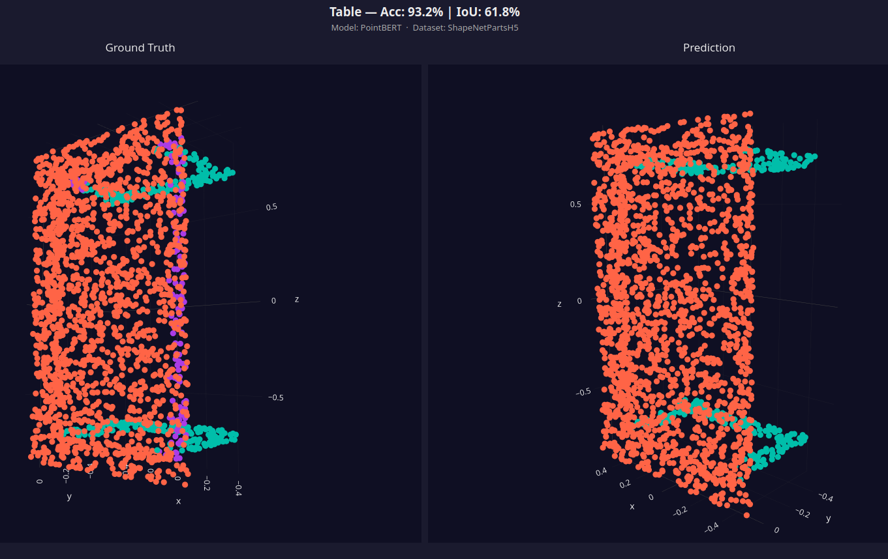

# Manhole Prediction with LIDARlearn

Deep Learning pipeline for evaluating different deep learning methods on manhole prediction.
[Jump to original README.](#lidarlearn)


<br><br>

---
### Installation

**System Setup:**

Python Environment Setup:<br>
[from here](https://github.com/said-ohamouddou/LIDARLearn#installation)
```bash
conda create -n lidarlearn python=3.11 -y
conda activate lidarlearn

pip install torch==2.4.1 torchvision==0.19.1 --index-url https://download.pytorch.org/whl/cu118

pip install torch-scatter torch-cluster -f https://data.pyg.org/whl/torch-2.4.1+cu118.html
pip install torch-geometric

python -c "import torch_scatter, torch_cluster; print(torch_scatter.__version__, torch_cluster.__version__)"

git clone https://github.com/M-106/LIDARLearn_Manhole_Prediction.git
cd LIDARLearn_Manhole_Prediction
pip install -r requirements.txt
```

<br><br>

Compilation of code:
```bash
pip install ninja
sudo apt install -y nvidia-cuda-toolkit
pip install cuda-toolkit==11.8
python -c "import torch; print(torch.cuda.is_available()); print(torch.version.cuda)"

sudo apt install gcc-11 g++-11
# set gcc to version 11 -> https://github.com/M-106/CPP/blob/main/docs/Basics/Installation.md#installation_on_linux
# IMPORTANT -> gcc-11 should be the active compiler, check the link above to make sure about this

# install cuda in the right version
# from https://developer.nvidia.com/cuda-11-8-0-download-archive?target_os=Linux&target_arch=x86_64&Distribution=Debian&target_version=11&target_type=runfile_local
wget https://developer.download.nvidia.com/compute/cuda/11.8.0/local_installers/cuda_11.8.0_520.61.05_linux.run
chmod +x cuda_11.8.0_520.61.05_linux.run
sudo sh cuda_11.8.0_520.61.05_linux.run
# ONLY install `CUDA Toolkit` in this process!
# Please refer to this website for help/guidance: https://github.com/M-106/Project-Helper/blob/main/guides/Remote_ML_Workflow_and_GPU_Management.md#cuda
# IMPORTANT -> adding cuda to the path is decribed on this website, you have to do that!

bash extensions/install_extensions.sh --clean
```

You should see something like:
```text
(lidarlearn) tobia@Vampire-Station:~/HDD/src/LIDARLearn_Manhole_Prediction$ bash extensions/install_extensions.sh --clean
Cleaning build artifacts...
Removing stale pip installations...
Done.

PyTorch 2.4.1+cu118 | CUDA 11.8 | GPU: NVIDIA GeForce RTX 4060 (sm_8.9)

============================================================
 Core Extensions
============================================================
[pointnet2_ops] Building... OK
[chamfer_dist] Building... OK

============================================================
 Model-Specific Extensions
============================================================
[dela_cutils] Building... OK
[pointops] Building... OK
[ptv_modules] Building... OK
[clip] Building... OK
[index_max] Building... OK

============================================================
 7 passed, 0 failed (out of 7 extensions)
============================================================
```

```bash
bash extensions/chamfer_dist/install.sh
```

```bash
pip install pytest
python -m pytest tests/test_configs.py -v
# or
PYTEST_DISABLE_PLUGIN_AUTOLOAD=1 pytest tests/test_configs.py -v
```

My Output:
```bash
- Docs: https://docs.pytest.org/en/stable/how-to/capture-warnings.html
=================================== short test summary info ====================================
FAILED tests/test_configs.py::test_classification_model_builds[cfgs/classification/ACT/HELIALS/helials_pretrain.yaml] - FileNotFoundError: ACT_PointDistillation_Pretrain: [Errno 2] No such file or directory: 'pr...
FAILED tests/test_configs.py::test_classification_model_builds[cfgs/classification/ACT/ShapeNet55/shapenet55_pretrain.yaml] - FileNotFoundError: ACT_PointDistillation_Pretrain: [Errno 2] No such file or directory: 'pr...
FAILED tests/test_configs.py::test_classification_model_builds[cfgs/classification/PointBERT/HELIALS/helials_pretrain.yaml] - FileNotFoundError: PointBERT_Pretrain: [Errno 2] No such file or directory: 'pretrained/dVA...
FAILED tests/test_configs.py::test_classification_model_builds[cfgs/classification/PointBERT/ShapeNet55/shapenet55_pretrain.yaml] - FileNotFoundError: PointBERT_Pretrain: [Errno 2] No such file or directory: 'pretrained/dVA...
==================== 4 failed, 1109 passed, 20 warnings in 83.50s (0:01:23) ====================
```

<br><br>

Other Adjustments (already done but maybe you want to adjust your datapath or something):
- `datasets/WHUUrban3DDataset.py`
- `datasets/__init__.py`
- `cfgs/segmentation/PointNet/WHUUrban3D/pointnet_whuurban3D.yaml`
- `cfgs/dataset/WHUUrban3DDataset.yaml`


<br><br>

---
### Start Training

```bash
cd ~/HDD/src/LIDARLearn_Manhole_Prediction
python main.py --config cfgs/segmentation/PointNet/WHUUrban3D/pointnet_whuurban3D.yaml \
               --mode seg \
               --exp_name manhole_segmentation_pointnet_test_run
```


<br><br>

---
### Train & Test Split

```bash
conda create -n whu3d python=3.12 pip -y
conda activate whu3d

pip install pywhu3d

cd ~/OtherSSD/data/whu3d
python -c "from pywhu3d.tool import WHU3D;whu3d = WHU3D(data_root='.', data_type='mls', format='h5');print('Train Split', WHU3D(data_root='.', data_type='mls', format='txt', scenes=whu3d.train_split).scenes);print('Val Split', WHU3D(data_root='.', data_type='mls', format='txt', scenes=whu3d.val_split).scenes);print('Test Split', WHU3D(data_root='.', data_type='mls', format='txt', scenes=whu3d.test_split).scenes)"
```

see [notebook](./whu_split.ipynb)

Result

```text
loading h5 data... ━━━━━━━━━━━━━━━━━━━━━━━━━━━━━━━━━━━━━━━━ 100% 0:01:52
Num of scenes: 38

Unknown Loading Error!
Num of scenes: 26
Train Split ['0404', '0424', '0434', '0444', '0940', '0947', '2002', '2321', '2322', '2422', '2447', '2719', '3405', '3648', '3918', '4333', '4629', '4938', '5642', '6017', '6027', '6037', '8018', '1046', '0414', '0502']

Unknown Loading Error!
Num of scenes: 4
Val Split ['2323', '8008', '8038', '2421']

Unknown Loading Error!
Num of scenes: 9
Test Split ['2323', '2522', '2810', '5627', '8008', '8038', '2421', '2423', '2521']

```


<br><br>


**Original README:**


<div align="center">


# LIDARLearn

**The Broadest-Coverage Unified PyTorch Library for 3D Point Cloud Deep Learning**

*Classification · Semantic Segmentation · Part Segmentation · Self-Supervised Pre-training · Parameter-Efficient Fine-Tuning · Few-Shot*

[](https://arxiv.org/abs/2604.10780)
[](LICENSE)
[](https://www.python.org/)
[](https://pytorch.org/)



*Paper:* [LIDARLearn: A Unified Deep Learning Library for 3D Point Cloud Classification, Segmentation, and Self-Supervised Representation Learning](https://arxiv.org/abs/2604.10780) · *Demo:* [Google Drive walkthrough](https://drive.google.com/drive/folders/1TR4mR9aXYXpvM2RNBFuYb1gYn1uSKad5?usp=sharing)

**📄 See what LIDARLearn produces →** [**`docs/model_comparison_tables.pdf`**](docs/model_comparison_tables.pdf) — a real, publication-ready PDF auto-generated by the library from raw training logs. No manual typesetting. This one-click report pipeline is LIDARLearn's headline contribution.

</div>

---

## Overview

**LIDARLearn** ships the **most complete off-the-shelf catalogue of 3D point cloud deep-learning methods** we're aware of — **56 model configurations** covering 29 supervised backbones, 7 self-supervised pre-training methods, and 5 parameter-efficient fine-tuning (PEFT) strategies (DAPT, IDPT, PPT, GST, VPT-Deep) composable with 4 of the SSL backbones (ACT, PointGPT, Point-MAE, ReCon) — all exposed through a single registry-based framework with YAML-driven configs, standardised runners, automatic LaTeX/CSV reporting, and a 2 200+ test `pytest` suite.

Designed for **researchers and engineers** who need to run **apples-to-apples benchmarks** across heterogeneous 3D point-cloud sources in the same pipeline:

- **General 3D data** — ModelNet40, ShapeNet-55/34, ShapeNet Part
- **Indoor 3D scans** — S3DIS (Matterport-style RGB + XYZ, semantic segmentation)
- **Terrestrial Laser Scanning (TLS)** — STPCTLS (tree species classification on high-density ground-based scans)
- **Aerial / helicopter LiDAR (ALS)** — HELIALS (tree species from sparse-to-dense aerial point clouds)

Same YAML schema, same CLI, same report generators for all of them — swap the dataset, keep the model and training recipe constant. Supported tasks: **classification**, **semantic segmentation**, **part segmentation**, and **few-shot classification**, with built-in stratified *K*-fold cross-validation and Friedman/Nemenyi statistical analysis.

## Supported Models

The matrix below enumerates every (model × fine-tuning strategy) pair shipped
with ready-to-run YAML configs. Columns:
**Cls** — object classification (ModelNet40 / STPCTLS / HELIALS / ModelNetFewShot),
**PartSeg** — part segmentation (ShapeNetParts),
**SemSeg** — semantic segmentation (S3DIS).
"Strategy" is the PEFT adapter applied on top of an SSL backbone:
**FF** = full finetuning (no PEFT), plus 5 PEFT methods — **DAPT**, **IDPT**, **PPT**, **GST** (PointGST), **VPT-Deep**.
The 7 SSL backbones also support pre-training on ShapeNet-55.

<table border="1" cellpadding="6" cellspacing="0">
<thead>
<tr><th>Category</th><th>Model</th><th>Strategy</th><th align="center">Cls</th><th align="center">PartSeg</th><th align="center">SemSeg</th></tr>
</thead>
<tbody>
<tr><td rowspan="15"><b>Point-based</b></td><td>PointNet</td><td>—</td><td align="center">✓</td><td align="center">✓</td><td align="center">✓</td></tr>
<tr><td>PointNet2-SSG</td><td>—</td><td align="center">✓</td><td align="center">✓</td><td align="center">✓</td></tr>
<tr><td>PointNet2-MSG</td><td>—</td><td align="center">✓</td><td align="center">✓</td><td align="center">✓</td></tr>
<tr><td>SONet</td><td>—</td><td align="center">✓</td><td align="center">—</td><td align="center">—</td></tr>
<tr><td>PPFNet</td><td>—</td><td align="center">✓</td><td align="center">—</td><td align="center">—</td></tr>
<tr><td>PointCNN</td><td>—</td><td align="center">✓</td><td align="center">—</td><td align="center">—</td></tr>
<tr><td>PointWeb</td><td>—</td><td align="center">✓</td><td align="center">✓</td><td align="center">✓</td></tr>
<tr><td>PointConv</td><td>—</td><td align="center">✓</td><td align="center">✓</td><td align="center">✓</td></tr>
<tr><td>RSCNN</td><td>—</td><td align="center">✓</td><td align="center">✓</td><td align="center">✓</td></tr>
<tr><td>PointMLP</td><td>—</td><td align="center">✓</td><td align="center">✓</td><td align="center">✓</td></tr>
<tr><td>PointSCNet</td><td>—</td><td align="center">✓</td><td align="center">✓</td><td align="center">✓</td></tr>
<tr><td>RepSurf</td><td>—</td><td align="center">✓</td><td align="center">✓</td><td align="center">✓</td></tr>
<tr><td>PointKAN</td><td>—</td><td align="center">✓</td><td align="center">✓</td><td align="center">✓</td></tr>
<tr><td>DELA</td><td>—</td><td align="center">✓</td><td align="center">✓</td><td align="center">✓</td></tr>
<tr><td>RandLA-Net</td><td>—</td><td align="center">—</td><td align="center">✓</td><td align="center">✓</td></tr>
<tr><td rowspan="8"><b>Attention-based</b></td><td>PCT</td><td>—</td><td align="center">✓</td><td align="center">✓</td><td align="center">✓</td></tr>
<tr><td>P2P</td><td>—</td><td align="center">✓</td><td align="center">✓</td><td align="center">✓</td></tr>
<tr><td>PointTNT</td><td>—</td><td align="center">✓</td><td align="center">✓</td><td align="center">✓</td></tr>
<tr><td>GlobalTransformer</td><td>—</td><td align="center">✓</td><td align="center">✓</td><td align="center">✓</td></tr>
<tr><td>PVT</td><td>—</td><td align="center">✓</td><td align="center">✓</td><td align="center">✓</td></tr>
<tr><td>PointTransformer</td><td>—</td><td align="center">✓</td><td align="center">✓</td><td align="center">✓</td></tr>
<tr><td>PointTransformerV2</td><td>—</td><td align="center">✓</td><td align="center">✓</td><td align="center">✓</td></tr>
<tr><td>PointTransformerV3</td><td>—</td><td align="center">✓</td><td align="center">✓</td><td align="center">✓</td></tr>
<tr><td rowspan="7"><b>Graph-based</b></td><td>DGCNN</td><td>—</td><td align="center">✓</td><td align="center">✓</td><td align="center">✓</td></tr>
<tr><td>DeepGCN</td><td>—</td><td align="center">✓</td><td align="center">✓</td><td align="center">✓</td></tr>
<tr><td>CurveNet</td><td>—</td><td align="center">✓</td><td align="center">✓</td><td align="center">✓</td></tr>
<tr><td>GDANet</td><td>—</td><td align="center">✓</td><td align="center">✓</td><td align="center">✓</td></tr>
<tr><td>MS-DGCNN</td><td>—</td><td align="center">✓</td><td align="center">✓</td><td align="center">✓</td></tr>
<tr><td>KAN-DGCNN</td><td>—</td><td align="center">✓</td><td align="center">✓</td><td align="center">✓</td></tr>
<tr><td>MS-DGCNN++</td><td>—</td><td align="center">✓</td><td align="center">✓</td><td align="center">✓</td></tr>
<tr><td rowspan="27"><b>Self-supervised</b></td><td rowspan="6">Point-MAE</td><td>FF</td><td align="center">✓</td><td align="center">✓</td><td align="center">✓</td></tr>
<tr><td>DAPT</td><td align="center">✓</td><td align="center">✓</td><td align="center">✓</td></tr>
<tr><td>IDPT</td><td align="center">✓</td><td align="center">✓</td><td align="center">✓</td></tr>
<tr><td>PPT</td><td align="center">✓</td><td align="center">✓</td><td align="center">✓</td></tr>
<tr><td>GST</td><td align="center">✓</td><td align="center">✓</td><td align="center">✓</td></tr>
<tr><td>VPT-Deep</td><td align="center">✓</td><td align="center">—</td><td align="center">—</td></tr>
<tr><td rowspan="6">ACT</td><td>FF</td><td align="center">✓</td><td align="center">✓</td><td align="center">✓</td></tr>
<tr><td>DAPT</td><td align="center">✓</td><td align="center">✓</td><td align="center">✓</td></tr>
<tr><td>IDPT</td><td align="center">✓</td><td align="center">✓</td><td align="center">✓</td></tr>
<tr><td>PPT</td><td align="center">✓</td><td align="center">✓</td><td align="center">✓</td></tr>
<tr><td>GST</td><td align="center">✓</td><td align="center">✓</td><td align="center">✓</td></tr>
<tr><td>VPT-Deep</td><td align="center">✓</td><td align="center">—</td><td align="center">—</td></tr>
<tr><td rowspan="6">ReCon</td><td>FF</td><td align="center">✓</td><td align="center">✓</td><td align="center">✓</td></tr>
<tr><td>DAPT</td><td align="center">✓</td><td align="center">✓</td><td align="center">✓</td></tr>
<tr><td>IDPT</td><td align="center">✓</td><td align="center">✓</td><td align="center">✓</td></tr>
<tr><td>PPT</td><td align="center">✓</td><td align="center">✓</td><td align="center">✓</td></tr>
<tr><td>GST</td><td align="center">✓</td><td align="center">✓</td><td align="center">✓</td></tr>
<tr><td>VPT-Deep</td><td align="center">✓</td><td align="center">—</td><td align="center">—</td></tr>
<tr><td rowspan="6">PointGPT</td><td>FF</td><td align="center">✓</td><td align="center">✓</td><td align="center">✓</td></tr>
<tr><td>DAPT</td><td align="center">✓</td><td align="center">—</td><td align="center">—</td></tr>
<tr><td>IDPT</td><td align="center">✓</td><td align="center">—</td><td align="center">—</td></tr>
<tr><td>PPT</td><td align="center">✓</td><td align="center">—</td><td align="center">—</td></tr>
<tr><td>GST</td><td align="center">✓</td><td align="center">—</td><td align="center">—</td></tr>
<tr><td>VPT-Deep</td><td align="center">✓</td><td align="center">—</td><td align="center">—</td></tr>
<tr><td>Point-M2AE</td><td>FF</td><td align="center">✓</td><td align="center">✓</td><td align="center">✓</td></tr>
<tr><td>Point-BERT</td><td>FF</td><td align="center">✓</td><td align="center">✓</td><td align="center">✓</td></tr>
<tr><td>PCP-MAE</td><td>FF</td><td align="center">✓</td><td align="center">✓</td><td align="center">✓</td></tr>
</tbody>
</table>

**Total: 56 configurations** (29 supervised × FF, 7 SSL × FF, 4 SSL × 5 PEFT = 20). See [`THIRD_PARTY_NOTICES.md`](THIRD_PARTY_NOTICES.md) for per-model licences and upstream repositories, and [`docs/point_cloud_methods.csv`](docs/point_cloud_methods.csv) for paper titles and venues.

## Key Features

- **Unified config system** — one YAML per experiment, `_base_` inheritance, identical CLI across every model and task.
- **Cross-validation** — stratified *K*-fold with aggregated metrics (`--run_all_folds`).
- **Friedman / Nemenyi** — non-parametric multi-model statistical testing with critical-difference diagrams (`scripts/reports/friedman_significance_report.py`).
- **Automated reporting** — publication-ready, standalone LaTeX documents auto-generated from experiment folders (`scripts/reports/`). Best value per metric column is auto-bolded (`\textbf{}`). Every report supports `--use_citation_in_tables` to inline `\citep{}` in the tables, or a single citation paragraph above them by default.
- **SSL pre-training** — ShapeNet-55 pre-training recipes for all 7 SSL backbones.
- **PEFT** — 5 fine-tuning strategies composable with any SSL backbone via a single `finetuning_strategy` field.
- **Testing** — L1 config-parse · L2 forward-shape · L3 pretrained-load · L4 script-coverage.
- **Visualisation** — interactive 3D HTML for classification, part-seg, and semantic-seg predictions.
- **Confusion matrices** — per-run confusion matrix PNG + CSV auto-exported for every classification experiment, so per-class errors are visible without extra tooling.
- **Training curves** — train/validation loss and accuracy history plotted and saved as PNG after every run, giving an at-a-glance convergence check.

## Installation

LIDARLearn is validated on **Python 3.11 + PyTorch 2.4.1 + CUDA 11.8**. The steps below reproduce that exact environment. `torch-scatter` and `torch-cluster` are installed separately from the official PyG wheel index because their wheels are pinned to a specific (torch × CUDA) pair — installing them via plain `pip install` will either fail or pull the wrong build.

### 1. Create a fresh conda environment

```bash
conda create -n lidarlearn python=3.11 -y
conda activate lidarlearn
```

### 2. Install PyTorch 2.4.1 with CUDA 11.8

```bash
pip install torch==2.4.1 torchvision==0.19.1 --index-url https://download.pytorch.org/whl/cu118
```

### 3. Install `torch-scatter` and `torch-cluster` from the PyG wheel index

Pass the torch+CUDA tag in the URL — this is what avoids the "wrong ABI / no CUDA" failures:

```bash
pip install torch-scatter torch-cluster -f https://data.pyg.org/whl/torch-2.4.1+cu118.html
pip install torch-geometric
```

Verify they resolved to the CUDA wheels (not CPU-only fallbacks):

```bash
python -c "import torch_scatter, torch_cluster; print(torch_scatter.__version__, torch_cluster.__version__)"
```

### 4. Clone the repo and install the remaining requirements

```bash
git clone https://github.com/said-ohamouddou/LIDARLearn.git
cd LIDARLearn
pip install -r requirements.txt
```

(The `torch-scatter` / `torch-cluster` / `torch-geometric` lines in `requirements.txt` are kept as a safety net and will be a no-op since step 3 already installed them.)

### 5. Build the CUDA C++ extensions

```bash
bash extensions/install_extensions.sh
```

This builds 7 extensions: `pointnet2_ops`, `chamfer_dist`, `dela_cutils`, `pointops`, `ptv_modules`, `clip`, and `index_max` (needed by SO-Net). If you're on CPU-only or don't need the models that depend on them, individual extensions can fail without blocking the rest of the library — the affected models are guarded by `_safe_import` in [`models/__init__.py`](models/__init__.py) and simply won't register.

### 6. Verify the install

```bash
PYTEST_DISABLE_PLUGIN_AUTOLOAD=1 pytest tests/test_configs.py -v
```

All 1100+ config-build tests should pass. If SONet tests fail with `Model 'SONet' is not registered`, re-run step 5 and check that `index_max` built successfully.

---

**Tested setup.** LIDARLearn has been developed and validated on:

- **OS** Ubuntu 22.04
- **CPU** AMD Ryzen 7 5700X (8 cores / 16 threads)
- **GPU** NVIDIA GeForce RTX 4060 Ti (single-GPU; all runs validated on a single-GPU configuration)
- **Python** 3.11.10
- **PyTorch** 2.4.1 (`+cu118`) / **torchvision** 0.19.1 (`+cu118`)
- **CUDA** 11.8 (nvcc 11.8.89)
- **torch-scatter / torch-cluster** from `https://data.pyg.org/whl/torch-2.4.1+cu118.html`
- **timm** 0.4.5
- **ninja** (for C++/CUDA extension builds)

> Other combinations (Python ≥ 3.8, PyTorch ≥ 1.13, CUDA ≥ 11.3) are likely to work but have not been exhaustively tested. If you use a different torch/CUDA pair, update the URL in step 3 to match — e.g. `torch-2.3.0+cu121` for torch 2.3 on CUDA 12.1. **Feedback and compatibility reports from other versions are very welcome** — please open an issue with your environment details.
>
> **Multi-GPU / distributed.** The codebase wires through `torch.distributed` (see [`utils/dist_utils.py`](utils/dist_utils.py)) but every shipped benchmark was run on a single GPU. **Feedback from users running multi-GPU or distributed setups is especially welcome** — please open an issue with your launcher, world size, and any adjustments needed.

## Pretrained SSL Weights

The 7 self-supervised backbones (Point-MAE, Point-BERT, PointGPT, ACT, ReCon, PCP-MAE, Point-M2AE) need a pretrained checkpoint to fine-tune from. All checkpoints are published together on Google Drive:

**Download:** [Google Drive — LIDARLearn pretrained weights](https://drive.google.com/drive/folders/1u0EbvwVji_fAMD2GghoNviyzyXxxaUMa?usp=sharing)

Place every downloaded `.pth` into [`pretrained/`](pretrained/) at the repo root:

```
pretrained/
├── pretrained_mae.pth     # Point-MAE    — used by cfgs/classification/PointMAE/**
├── pretrained_bert.pth    # Point-BERT   — cfgs/classification/PointBERT/**
├── pretrained_gpt.pth     # PointGPT     — cfgs/classification/PointGPT/**
├── pretrained_act.pth     # ACT          — cfgs/classification/ACT/**
├── pretrained_recon.pth   # ReCon        — cfgs/classification/RECON/**
├── pretrained_pcp.pth     # PCP-MAE      — cfgs/classification/PCPMAE/**
├── pretrained_m2ae.pth    # Point-M2AE   — cfgs/classification/PointM2AE/**
├── act_dvae.pth           # ACT dVAE tokeniser (needed only for ACT pre-training)
└── dVAE.pth               # Point-BERT dVAE tokeniser (needed only for Point-BERT pre-training)
```

Pass the relevant checkpoint via `--ckpts pretrained/<name>.pth` when fine-tuning, e.g.:

```bash
python main.py --config cfgs/classification/PointMAE/STPCTLS/stpctls_cv_dapt.yaml \
    --ckpts pretrained/pretrained_mae.pth --run_all_folds --seed 42
```

Each loader strips the appropriate state-dict prefix (`MAE_encoder.`, `ACT_encoder.`, `transformer_q.`, `GPT_Transformer.`, …) so checkpoints trained with different SSL objectives all map cleanly onto the finetune model. See [`tests/test_pretrained_load.py`](tests/test_pretrained_load.py) for the verification logic that asserts every loader actually consumes its checkpoint (guards against silent prefix-mismatch failures).

You can skip this section entirely if you only plan to train the 29 supervised backbones — they don't need any pretrained weights.

## Supported Datasets

| Dataset | Task | Loader |
|---|---|---|
| **ModelNet40** | Classification (40 classes) | [`datasets/ModelNetDataset.py`](datasets/ModelNetDataset.py) |
| **ModelNet40-FewShot** | Few-shot classification (5/10-way, 10/20-shot) | [`datasets/ModelNetDatasetFewShot.py`](datasets/ModelNetDatasetFewShot.py) |
| **ShapeNet-55** | SSL pre-training | [`datasets/ShapeNet55DatasetPretrain.py`](datasets/ShapeNet55DatasetPretrain.py) |
| **ShapeNet Part** | Part segmentation (50 classes, 16 categories) | [`datasets/ShapeNet55Dataset.py`](datasets/ShapeNet55Dataset.py) |
| **S3DIS** | Indoor semantic segmentation (13 classes) | [`datasets/S3DISDataset.py`](datasets/S3DISDataset.py) |
| **STPCTLS** ([Göttingen Research Online](https://data.goettingen-research-online.de/dataset.xhtml?persistentId=doi:10.25625/FOHUJM)) | LiDAR tree species (7 classes, TLS point clouds) | [`datasets/TreeSpeciesDataset.py`](datasets/TreeSpeciesDataset.py) |
| **STPCTLS-CV** | STPCTLS with stratified *K*-fold CV | [`datasets/TreeSpeciesDatasetCV.py`](datasets/TreeSpeciesDatasetCV.py) |
| **HELIALS** ([Zenodo 17077256](https://zenodo.org/records/17077256)) | Helicopter ALS tree species | [`datasets/TreeSpeciesDatasetHELIALS.py`](datasets/TreeSpeciesDatasetHELIALS.py) |

Dataset download and preparation instructions are in [`DATASET.md`](DATASET.md). For convenience, the **preprocessed STPCTLS data is already included in the repository** (under [`data/`](data/)) so you can reproduce the tree-species benchmark out of the box without any external download.

## Quick Start

```bash
# 1. Train PointNet on STPCTLS (simple 80/20 split)
python main.py --config cfgs/classification/PointNet/STPCTLS/stpctls.yaml \
    --mode finetune --seed 42 --exp_name pointnet_stpctls

# 2. Train DGCNN on STPCTLS with 5-fold cross-validation
python main.py --config cfgs/classification/DGCNN/STPCTLS/stpctls_cv.yaml \
    --mode finetune --seed 42 --run_all_folds --exp_name dgcnn_stpctls_cv

# 3. Pre-train Point-MAE on ShapeNet-55
python main.py --config cfgs/classification/PointMAE/ShapeNet55/shapenet55_pretrain.yaml \
    --mode pretrain --exp_name mae_pretrain

# 4. Fine-tune with DAPT on STPCTLS (5-fold CV)
python main.py --config cfgs/classification/PointMAE/STPCTLS/stpctls_cv_dapt.yaml \
    --ckpts pretrained/pretrained_mae.pth --run_all_folds --seed 42

# 5. Generate publication-ready LaTeX tables (outputs land in <exp_dir>/latex/)
python scripts/reports/classification_comparison_report.py --exp_dir experiments/STPCTLS

# 6. Friedman / Nemenyi statistical analysis (outputs land in <exp_dir>/friedman/)
python scripts/reports/friedman_significance_report.py --exp_dir experiments/STPCTLS
```

Sweep the entire benchmark with a single command:

```bash
bash scripts/train_stpctls.sh      # all 56 classification configs
bash scripts/train_fewshot.sh      # few-shot evaluation
bash scripts/train_s3dis.sh        # semantic segmentation
bash scripts/train_shapenetparts.sh # part segmentation
```

> **Training a subset of models.** The `scripts/train_*.sh` files are plain
> bash with one `python main.py ...` line per model (each preceded by an
> `echo "[N/M] <Name>"` header). To run only a subset, open the script and
> either comment out (`#`) the models you want to skip, or copy the
> `python main.py ...` line(s) you want directly to your shell. The report
> scripts pick up whichever `cv_summary.csv` files exist under
> `experiments/<NAME>/`, so partial runs produce valid tables for the
> models you did train.

### Which runner: `runner_finetune` vs `runner_finetune_test`

Classification / fine-tuning goes through two wired-up runners, exposed in [`main.py`](main.py) as:

```python
from tools import finetune_run_net as finetune              # default
from tools.runner_finetune_test import run_net as finetune_test  # 3-way split
```

Select with the `--runner` flag (default `runner_finetune`):

| Runner | Data splits used | "Best checkpoint" chosen on | Final metric reported on | Use when |
|---|---|---|---|---|
| `runner_finetune` *(default)* | `dataset.train` + `dataset.val` | validation | **validation** | You have a train/val 2-way split (ModelNet40, STPCTLS CV folds, fewshot episodes). Validation is both the selection signal AND the reported number. |
| `runner_finetune_test` | `dataset.train` + `dataset.val` + `dataset.test` | validation | **test** | You have a genuine 3-way split and want the best checkpoint selected on val but the final headline number computed on a held-out test set (cleanest protocol for paper-style reporting). |

```bash
# 2-way (default): val metrics are the final numbers
python main.py --config cfgs/classification/DGCNN/STPCTLS/stpctls.yaml --mode finetune --exp_name dgcnn

# 3-way: best ckpt on val, final metrics on test
python main.py --config cfgs/classification/PointMAE/STPCTLS/stpctls_test.yaml \
    --mode finetune --runner runner_finetune_test --exp_name pointmae_test
```

Both runners write the same `cv_summary.csv` schema so the LaTeX reporters in `scripts/reports/` work unchanged. **Single-run (non-CV) experiments still produce a `cv_summary.csv`** — the per-metric strings are just formatted as `value ± 0.00` (zero std), so downstream tables and Friedman/Nemenyi scripts see a consistent shape whether you ran 1 fold or K folds.

### Online Augmentation

Point-cloud augmentations are implemented in [`datasets/augmentation.py`](datasets/augmentation.py) and applied **online** — on the GPU, per batch, inside the training loop — not baked into disk files. That means:

- **Every epoch sees freshly-sampled augmentations** (different rotations, jitter noise, dropout masks) even though the underlying `.xyz` / `.h5` data on disk is fixed.
- **Applied to training only** — validation and test passes skip augmentation (only the always-on unit-sphere normalisation runs there). Guarded at the call site in [`tools/runner_finetune.py:255`](tools/runner_finetune.py#L255), so every model/config gets the same guarantee without extra code.
- **GPU-side** — transforms take and return a `(B, C, N)` or `(B, N, C)` `torch.Tensor` already on CUDA, so there's no CPU→GPU round-trip in the data path.

**Enable via `--augmentation <name>`** (default: `none`). Choices are defined in [`utils/parser.py`](utils/parser.py) and map 1:1 to classes in the augmentation module:

| Flag | What it does |
|---|---|
| `none` | Identity — no augmentation (default) |
| `rotate` | Random 3D rotation around all three axes |
| `scale_translate` | Combined random uniform scaling + translation |
| `jitter` | Additive Gaussian noise on every point |
| `scale` | Random uniform scaling only |
| `translate` | Random translation only |
| `dropout` | Random point dropout (mask out a fraction of points) |
| `flip` | Random axis flipping (x or y) |
| `z_rotate_tree` | Rotation around Z-axis only — right default for upright tree scans (TLS / ALS) where up is meaningful |

**Example — full-sweep smoke test with Z-axis rotation for tree data:**

```bash
python main.py --config cfgs/classification/PointMAE/STPCTLS/stpctls_cv.yaml \
    --augmentation z_rotate_tree --run_all_folds --seed 42 \
    --exp_name pointmae_stpctls_cv_zrot
```

**Composing multiple transforms.** The CLI takes a single name, but the underlying `get_train_transforms()` API accepts a list — compose chains like `['z_rotate_tree', 'jitter', 'scale']` by calling it from a custom training script or by editing the runner. Every composed transform is re-randomised per batch.

**Reproducibility.** Augmentations use the global torch/numpy RNG, so passing `--seed 42` makes a full training run bitwise-reproducible across machines (assuming the same CUDA kernels). The selected transform is logged at the start of training via `fmt.print_augmentation(...)` so you can confirm from the log what ran.

### Visualization

All three viz scripts live in [`scripts/visulization/`](scripts/visulization/) and emit self-contained interactive HTML files (Plotly-based 3D scatter) plus `.npy` arrays and a text summary. Each page shows the **model name** and **dataset name** at the top so you never lose track of which run produced which output.

| Task | Script | Output |
|---|---|---|
| Classification | [`visualize_cls.py`](scripts/visulization/visualize_cls.py) | per-sample 3D HTML, confusion matrix, gallery `index.html` |
| Semantic segmentation | [`visualize_seg.py`](scripts/visulization/visualize_seg.py) | per-block GT/Pred side-by-side, per-class IoU summary |
| Part segmentation | [`visualize_partseg.py`](scripts/visulization/visualize_partseg.py) | per-shape GT/Pred side-by-side, per-category mIoU summary |

**Example — part segmentation with a fine-tuned PointBERT checkpoint:**

```bash
python scripts/visulization/visualize_partseg.py \
    --config cfgs/segmentation/PointBERT/ShapeNetParts/pointbert_partseg.yaml \
    --ckpt experiments/ShapeNetParts/pointbert_partseg/ckpt-best-seg.pth \
    --num_vis 30 \
    --out_dir experiments/ShapeNetParts/pointbert_partseg/vis
```

*(The PointBERT GT-vs-Pred image shown at the top of this README was generated by this command.)*

Open any `.html` in your browser for orbit/zoom/pan 3D interaction. The companion `.npy` files (`[N, 5] = x y z gt pred` for part seg; `[N, 8]` with RGB for semseg) are there for downstream analysis or custom plots.

### Automated reports — **LIDARLearn's headline contribution**

This is the feature that turns LIDARLearn from a training library into a **full research pipeline**. Run a sweep, call one report script, and walk away with a **fully-typeset LaTeX PDF + CSV + Markdown** ready to drop into a paper submission. No hand-built tables, no copy-pasting numbers into Overleaf, no formatting regressions when you rerun.

**See the actual output:** [**`docs/model_comparison_tables.pdf`**](docs/model_comparison_tables.pdf) — generated end-to-end by this library from raw training logs.

All report generators live in `scripts/reports/` and emit a standalone,
`pdflatex`-compilable `.tex` (plus CSV + Markdown) into `<exp_dir>/latex/`:

| Script | Produces |
|---|---|
| `classification_comparison_report.py` | CV classification table (one combined table) |
| `classification_comparison_split_report.py` | CV classification table split by SSL init source |
| `partseg_comparison_report.py` | ShapeNetParts part-seg comparison table |
| `semseg_comparison_report.py` | S3DIS semantic-seg summary + optional per-class IoU table (`--per_class`) |
| `fewshot_comparison_report.py` | Point-BERT-style few-shot table (5/10-way × 10/20-shot) |
| `friedman_significance_report.py` | Friedman + Nemenyi + Wilcoxon + CD-diagram report (written to `<exp_dir>/friedman/`) |
| `model_citations_report.py` | Standalone citation paragraph for every supported method |

Every generator accepts `--use_citation_in_tables` (inline `\citep{}` in each
cell). When omitted (default) a single `\paragraph{Methods.}` is prepended
above the tables. Bib keys are resolved from `scripts/reports/references.bib`.

**Best-in-column highlighting.** Every numeric column is scanned per-report
and the best value (highest for accuracy/IoU/F1/recall/precision, lowest for
param count and epoch time) is automatically wrapped in `\textbf{}` in the
LaTeX output and `**…**` in the Markdown output, so the top method stands
out at a glance. Ties are all bolded.

**Example reports** (fully compiled PDFs + source `.tex` / `.csv` / `.md`
from real benchmark runs) are shipped under `experiments/<dataset>/latex/`:

| Dataset | Task | Example output |
|---|---|---|
| HELIALS | Classification | [`experiments/HELIALS/latex/`](experiments/HELIALS/latex/) — `model_comparison_tables.{tex,pdf,csv,md}` |
| S3DIS | Semantic segmentation | [`experiments/S3DIS/latex/`](experiments/S3DIS/latex/) — `s3dis_comparison.{tex,pdf,csv,md}` |
| ShapeNetParts | Part segmentation | [`experiments/ShapeNetParts/latex/`](experiments/ShapeNetParts/latex/) — `shapenetparts_comparison.{tex,pdf,csv,md}` |

Each folder includes `references.bib` (auto-copied from `scripts/reports/references.bib`) so the `.tex` files compile standalone with `pdflatex` + `bibtex` — drop them straight into a paper submission.

## Project Structure

```
LIDARLearn/
├── cfgs/              # YAML configs (classification, segmentation, fewshot, pretrain)
├── datasets/          # Dataset loaders (ModelNet, ShapeNet, S3DIS, STPCTLS, HELIALS)
│                      #   + augmentation.py (shared pointcloud transforms)
├── models/            # Backbones, SSL methods, PEFT adapters, seg wrappers
├── tools/             # Training runners (finetune, pretrain, seg, fewshot)
├── utils/             # Config, logging, metrics, checkpoint, parser
├── scripts/           # Training sweeps (train_*.sh), visualisation, smoke tests
│   └── reports/       # LaTeX report generators (classification, partseg, semseg,
│                      #   fewshot, citations, Friedman significance) + shared references.bib
├── extensions/        # CUDA C++ extensions (pointnet2_ops, chamfer_dist, dela_cutils)
├── tests/             # pytest suite (L1-L4)
├── docs/              # Paper sources and documentation
└── main.py            # Unified entry point
```

## Testing

```bash
pytest tests/                      # full suite (~4 min on a single GPU)
pytest tests/test_configs.py       # L1: every YAML parses and builds
pytest tests/test_forward_shapes.py # L2: every model forward-passes correctly
```

## Roadmap / Open TODOs

Help wanted — these are the priorities we're actively looking for community contributions on:

- [ ] **More tests & benchmark feedback**, especially on long-running datasets such as **S3DIS** (semantic segmentation runs take many hours per config). If you have cluster time, please share logs, mIoU numbers, and any hyperparameter adjustments that worked for you.
- [ ] **Support arbitrary point dimensions (D > 3)** — current loaders mostly consume XYZ (plus RGB for a few datasets). Remote-sensing pipelines routinely need per-point **intensity, return number, number of returns, classification, scan angle, GPS time, multi-spectral bands**, etc. Goal: configurable input channels end-to-end (LAS/LAZ preprocessors → datasets → model `in_channels`) without per-model forks.
- [ ] **Reproduce and compare against paper-reported values.** For each model + dataset pair, we want a side-by-side table of LIDARLearn's numbers vs. the original paper's. Mismatches are opportunities to fix configs, augmentation pipelines, or training schedules.
- [ ] **Add new models** — recent point cloud backbones, SSL methods, and PEFT strategies that aren't in the [matrix above](#supported-models). Follow the three-step contribution workflow below.
- [ ] **Add 3D point cloud registration support** — task heads, dataset loaders (e.g., 3DMatch, KITTI odometry, ModelNet-registration), metrics (rotation/translation error, RRE/RTE), and reference methods (PPFNet is already vendored but not yet wired as a registration task).
- [ ] **Improve and optimize the code** — profile training/inference hot paths, reduce redundant tensor copies, add `torch.compile` / AMP support where it helps, cut memory overhead in large-scene seg runs, and clean up any remaining upstream-vendored code paths. PRs that shave GPU hours are especially welcome.
- [ ] **Windows and macOS support** — the project is currently developed and tested on Linux only. Windows needs PowerShell/`.bat` equivalents for `extensions/install_extensions.sh` and the `scripts/train_*.sh` sweep runners (or a WSL2 setup guide). macOS has no CUDA, so support would mean a CPU/MPS mode that gates the ~6 CUDA-only models (PointTransformerV2/V3, P2P, DeepGCN, DELA, RandLA-Net) on `torch.cuda.is_available()` and skips the CUDA extensions build. PRs adding either platform — with install instructions and at least one model verified end-to-end — very welcome.
- [ ] **Full documentation of every model and its hyperparameters** — a per-model reference page (markdown under `docs/models/` or a single consolidated table) covering: what the model does in 1-2 sentences, its YAML `model:` block keys, what each hyperparameter controls, recommended defaults per dataset family (ModelNet40 / ShapeNet / STPCTLS / HELIALS / S3DIS), memory/compute footprint, and any model-specific gotchas (e.g., input channel assumptions, required preprocessors, supported task heads).
- [ ] **Any community proposal that improves LIDARLearn** — new features, API refinements, documentation, tooling, CI, visualization helpers, or anything else. Open an issue first to discuss scope, then send a PR.

## Contributing

Contributions are welcome! Whether you're adding a new backbone, a new dataset loader, a PEFT strategy, or fixing a bug, the workflow is:

1. **Fork** the repository and create a feature branch (`git checkout -b feat/my-model`).
2. **Add your model** in three steps — create `models/<name>/<name>.py` with a class inheriting `BasePointCloudModel` (or `BaseSegModel`) and decorated with `@MODELS.register_module()`, register it in `models/__init__.py`, and provide at least one YAML config under `cfgs/`.
3. **Run the test suite** — `pytest tests/` must pass. New models are automatically picked up by the L1 config-parse and L2 forward-shape tests.
4. **Follow the style** — keep YAML configs `_base_`-inherited, document non-obvious hyperparameters, and include the paper citation in your config header.
5. **Open a PR** describing the change, the reference paper/repository, and any benchmark numbers if available.

For bugs, feature requests, or questions, please open an issue on [GitHub](https://github.com/said-ohamouddou/LIDARLearn/issues) with a minimal reproducer (config + command + error log).

## License

LIDARLearn is released under the **MIT License** — see [`LICENSE`](LICENSE).

Individual model implementations retain their original licences (MIT or Apache-2.0). Full attribution is provided in [`THIRD_PARTY_NOTICES.md`](THIRD_PARTY_NOTICES.md).

## Credits

LIDARLearn builds on the outstanding work of the open-source point cloud community. Full per-model attribution — author, venue, original repository, and upstream licence — lives in [`THIRD_PARTY_NOTICES.md`](THIRD_PARTY_NOTICES.md); [`docs/point_cloud_methods.csv`](docs/point_cloud_methods.csv) has paper titles and venues.

Canonical BibTeX entries for **every** cited work (datasets, supervised backbones, SSL methods, PEFT strategies) are kept in **[`scripts/reports/references.bib`](scripts/reports/references.bib)**. Every LaTeX report produced by `scripts/reports/*.py` resolves its `\citep{}` commands against this file, and **auto-copies `references.bib` into `<exp_dir>/latex/`** so the generated `.tex` compiles end-to-end with:

```bash
cd <exp_dir>/latex && pdflatex <report>.tex && bibtex <report> && pdflatex <report>.tex && pdflatex <report>.tex
```

Framework inspiration: [Pointcept](https://github.com/Pointcept/Pointcept), [OpenPoints](https://github.com/guochengqian/openpoints), [Torch-Points3D](https://github.com/torch-points3d/torch-points3d), [Learning3D](https://github.com/vinits5/learning3d).

KAN layers used by PointKAN and KAN-DGCNN are built on top of [efficient-kan](https://github.com/Blealtan/efficient-kan) (MIT) — a fast, drop-in replacement for the original Kolmogorov–Arnold Network implementation.

## Citation

If you use LIDARLearn in your research, please cite:

```bibtex
@misc{ohamouddou2026lidarlearnunifieddeeplearning,
      title={LIDARLearn: A Unified Deep Learning Library for 3D Point Cloud Classification, Segmentation, and Self-Supervised Representation Learning},
      author={Said Ohamouddou and Hanaa El Afia and Abdellatif El Afia and Raddouane Chiheb},
      year={2026},
      eprint={2604.10780},
      archivePrefix={arXiv},
      primaryClass={cs.CV},
      url={https://arxiv.org/abs/2604.10780},
}
```

Preprint: <https://arxiv.org/abs/2604.10780>

## Contact

Issues and pull requests are welcome on [GitHub](https://github.com/said-ohamouddou/LIDARLearn/issues).

For direct inquiries, reach the maintainer at <said.ohamouddou1998@gmail.com>.
